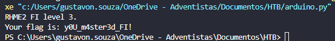

# Rhme - Fiasco WriteUp

Nesse writeup, vamos mostrar como conseguimos extrair uma flag escondida diretamente do arquivo `.hex` do firmware. O nome já dizia tudo: **fiasco**.

---

## 1 - O Arquivo HEX

Assim como nos outros desafios, recebemos um firmware para ser enviado ao Arduino, no caso o `fiasco.hex`.

Esse arquivo `.hex` nada mais é do que uma representação do conteúdo da memória do microcontrolador. Ele contém instruções e dados binários convertidos para hexadecimal, organizados em linhas com um formato padrão Intel HEX.

Mas… e se, por algum descuido, alguém tivesse deixado strings importantes ali dentro?

---

## 2 - Ideia do Ataque: Extração de Strings

A ideia foi simples, mas poderosa: extrair todas as **strings legíveis** contidas dentro do arquivo `.hex`, buscando por palavras-chave como `flag` ou `rhme`.

Pra isso, usamos um código em Python feito pra varrer byte a byte e reconstruir possíveis textos contidos ali, baseando-se apenas nos bytes que representam caracteres ASCII imprimíveis (ou seja, letras, números, símbolos etc).

Segue o script que usei:

```python

def buscar_strings_legiveis(arquivo_hex, comprimento_minimo=4):
    with open(arquivo_hex, 'r') as arquivo:
        buffer = ""
        for linha in arquivo:
            if linha.startswith(':'):
                dados_hex = linha[9:-3]
                for pos in range(0, len(dados_hex), 2):
                    segmento = dados_hex[pos:pos+2]
                    try:
                        caractere = chr(int(segmento, 16))
                        if 32 <= ord(caractere) <= 126:
                            buffer += caractere
                        else:
                            if len(buffer) >= comprimento_minimo:
                                yield buffer
                            buffer = ""
                    except Exception:
                        continue
        if len(buffer) >= comprimento_minimo:
            yield buffer

for trecho in buscar_strings_legiveis('fiasco.hex'):
    texto = trecho.lower()
    if 'flag' in texto or 'rhme' in texto:
        print(f"Flag: {trecho}")

```

---

## 3 - Resultado

Rodando esse script, obtivemos esse belo resultado no terminal:



---

## 4 - Explicação da Vulnerabilidade

A falha principal aqui foi uma **exposição de dados sensíveis diretamente no firmware**.

Isso é conhecido como **hardcoded sensitive data** — ou seja, dados como senhas, chaves de acesso ou até flags de CTF incluídos diretamente no código, sem nenhuma proteção ou ofuscação.

### Por que isso é um problema?

Quando um firmware é publicado (ou mesmo instalado em um dispositivo físico), qualquer pessoa com acesso a ele pode analisá-lo. Como o formato Intel HEX é aberto e bem documentado, ferramentas simples (ou um script de Python como o nosso) conseguem varrer o conteúdo e recuperar textos salvos na memória.

Isso torna o desafio **trivial de ser resolvido**, mesmo sem engenharia reversa ou conhecimento do funcionamento do programa.

### Situações reais

Em ambientes reais, esse tipo de vulnerabilidade pode expor:

- Credenciais de rede Wi-Fi,
- Chaves de API,
- Tokens de autenticação,
- E até portas de debug ativadas em produção.

Tudo isso representa riscos graves de segurança.