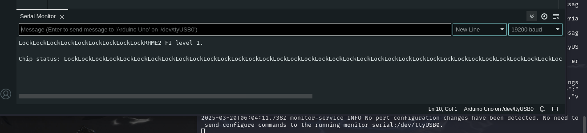

# RHme - Fiesta WriteUp

# 1 - Arquivo HEX

Da mesma forma que fizemos no desafio do AVR File System, devemos fazer agora, upar o arquivo .hex com:

```jsx
avrdude -c arduino -p atmega328p -P /dev/ttyUSB* -b115200 -u -V -U flash:w:filename.hex
```

Quando upamos o arquivo fiesta.hex no arduino, temos o seguinte resultado:



Após isso, a string “Lock” fica em loop

# 2 - Fault Injection

Lendo o ReadMe do desafio, ele nos dá a deixa de usar FI (Fault Injection).
Sinceramente, não fazia ideia do que era isso e como eu poderia executar esse ataque, então fui à pesquisa.
FI não é nada mais que forçar um erro no dispositivo para obter ou ir para aonde você quer, tem diversos meios para isso, de petelecos à uso de radiação.

# 3 - Petelecos…

Dando uma pesquisada, vi que algumas pessoas usavam o ChipWhisperer para fazer ataque no clock e pegar a flag, porém, eu obviamente não tenho como desembolsar um desses.
Recebi dicas de pegar a flag usando calor… não deu muito certo, quase queimei meu arduino.
Ao invés do calor, tentei somente com pequenos petelecos na parte de trás do arduino (um agradecimento ao Nekas pela dica) e então depois de pouco tempo dando esses petelecos….


:)