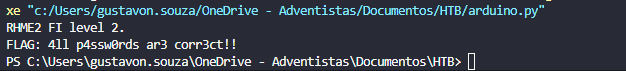

# Rhme - Fine Tuning WriteUp

---

## Análise Inicial

Recebi o firmware `fine_tuning.hex`. A princípio, o desafio esperava que o participante utilizasse glitching — uma técnica que altera temporariamente o comportamento do chip ao modificar sua alimentação —, mas isso acabou sendo desnecessário.

---

## Sobre a Vulnerabilidade

A falha principal aqui é a presença de **dados sensíveis armazenados em texto claro no firmware**. Isso é um erro comum em sistemas embarcados, onde desenvolvedores deixam mensagens de depuração, senhas ou até mesmo flags sem qualquer tipo de proteção.

Esse tipo de problema é classificado como **hardcoded sensitive data**. Não foi necessário nenhum tipo de engenharia reversa complexa, nem glitching. A simples leitura e interpretação dos dados já foi suficiente para encontrar a flag.

---

## Estratégia de Solução

Ao analisar o firmware, percebi que havia mensagens em ASCII gravadas diretamente na memória. Isso levantou a hipótese de que a flag também poderia estar visível.

Com isso, optamos por desenvolver um script em Python para extrair todas as sequências de caracteres ASCII imprimíveis com no mínimo 4 caracteres. Durante a varredura, qualquer string contendo as palavras-chave "flag" ou "rhme" era exibida.

(Sim, é o mesmo script utilizado no desafio Fiasco) :)

---

## Script Utilizado

```python
def extrair_strings(arquivo_hex, tamanho_minimo=4):
    with open(arquivo_hex, 'r') as arquivo:
        acumulador = ""
        for linha in arquivo:
            if linha.startswith(':'):
                dados = linha[9:-3]
                for i in range(0, len(dados), 2):
                    byte = dados[i:i+2]
                    try:
                        caractere = chr(int(byte, 16))
                        if 32 <= ord(caractere) <= 126:
                            acumulador += caractere
                        else:
                            if len(acumulador) >= tamanho_minimo:
                                yield acumulador
                            acumulador = ""
                    except:
                        continue
        if len(acumulador) >= tamanho_minimo:
            yield acumulador

for trecho in extrair_strings('fine_tuning.hex'):
    if 'flag' in trecho.lower() or 'rhme' in trecho.lower():
        print({trecho})

```

---

## Resultado da Execução

O código retornou a flag diretamente do conteúdo do firmware:



---