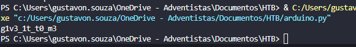

# Rhme - Jumpy WriteUp

Esse desafio foi um dos mais legais do RHme Fiesta. O binário “jumpy” é um ELF 32-bit que parece ser um joguinho simples. Só que, por trás disso, o que temos é um verdadeiro quebra-cabeça de engenharia reversa com verificações matemáticas malandras. O objetivo: descobrir a flag escondida dentro do programa.

---

## 1. Reconhecimento inicial

Comecei rodando os comandos básicos pra entender o binário:

```bash
file jumpy
# ELF 32-bit

checksec jumpy
# NX habilitado, mas sem PIE. Boa notícia!

```

Sabendo que não tem ASLR e que a stack é não executável, já imaginei que teria que explorar alguma lógica interna, não shellcode.

---

## 2. Engenharia reversa

Abrindo o binário no Ghidra, encontrei a função principal e uma série de verificações matemáticas em sequência. Elas pareciam testar se os caracteres digitados formavam a “senha certa”.

Dando uma olhada no código montado e nos ifs, percebi a estrutura mais ou menos assim:

```c
if (input[0] * input[1] == 0x13B7)
if (input[1] + input[2] == 0xA7)
...

```

Ou seja, cada caractere dependia do anterior. Era uma cadeia de validações. Isso já descartava brute force puro — o ideal seria resolver isso com um script.

---

## 3. O truque: resolver a sequência

Sabendo que essas verificações eram lineares (só multiplicações e somas), criei um script em Python para resolver cada etapa com um brute force leve.

Comecei com o primeiro valor conhecido (`input[0] = 0x67`, que é `'g'`) e fui preenchendo o resto da senha com base nas condições.

### Trecho do código:

```python
password = {}
password[0] = 0x67  # 'g'

for i in range(12):
    for z in range(256):
        if z in [0, 10, 13]: continue  # Evita chars problemáticos

        if i == 0 and password[i] * z == 0x13B7:
            password[i+1] = z; break
        elif i == 1 and password[i] + z == 0xA7:
            password[i+1] = z; break
        elif i == 2 and password[i] * z == 0x1782:
            password[i+1] = z; break
        elif i == 3 and password[i] + z == 0x92:
            password[i+1] = z; break
        elif i == 4 and password[i] * z == 0x122F:
            password[i+1] = z; break
        elif i == 5 and password[i] + z == 0xA5:
            password[i+1] = z; break
        elif i == 6 and password[i] * z == 0x2B0C:
            password[i+1] = z; break
        elif i == 7 and password[i] + z == 0xD3:
            password[i+1] = z; break
        elif i == 8 and password[i] * z == 0x15C0:
            password[i+1] = z; break
        elif i == 9 and password[i] + z == 0x8F:
            password[i+1] = z; break
        elif i == 10 and 13 * z == 0x297:
            password[12] = z; break
        elif i == 11 and password[12] + z == 0xA0:
            password[i] = z; break

```

Por fim, converti tudo pra string:

```python

flag = ''.join([chr(password[i]) for i in sorted(password.keys())])
print(flag)

```

---

## 4. Resultado

O script me deu a seguinte saída:

