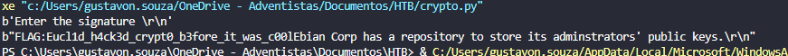

# Rhme - Key_Server Writeup

## 1 - Primeiros passos e análise do desafio

Depois de subir o firmware no Arduino e abrir o Serial Monitor, recebemos a seguinte mensagem:

```

Ebian Corp has a repository to store its adminstrators' public keys.
1)If you are a customer you can list all the public keys.
2)If you are an admin you can update your keys.
Just sign the plaintext "admin" and more options will be provided.
The parameters to be used for the signature are SHA1 and PKCS1_v1_5

```

Ou seja, temos basicamente dois perfis:

- Cliente: pode listar as chaves públicas já cadastradas.
- Administrador: pode atualizar as chaves, mas precisa provar que é admin assinando a palavra `"admin"` com uma assinatura válida.

A assinatura deve usar SHA1 como hash e PKCS#1 v1.5 como padding, ou seja, é uma assinatura RSA tradicional com esse esquema de padding.

---

## 2 - O desafio real

Para conseguir acessar as opções de admin, temos que provar que temos uma assinatura **válida da string "admin"** com uma chave privada correspondente.

Como não temos a chave privada dos administradores, o desafio é:

**como gerar ou forjar essa assinatura válida?**

---

## 3 - Vulnerabilidade comum: chaves públicas com primos em comum

Aqui entra uma vulnerabilidade clássica em criptografia de chave pública:

> Às vezes, diferentes chaves públicas podem ter sido geradas usando os mesmos números primos.
> 

Isso é um problemão, porque se duas chaves compartilham um fator primo, podemos calcular o **máximo divisor comum (MDC)** entre os dois módulos públicos.

No desafio, conseguimos encontrar esse divisor comum entre as chaves de dois usuários — vamos chamar eles de Bob e Gary:

```

0xf3432ec95a2d8ec3e2dc6c52c1eb97d03601d6a0c1e89848fe54f55b31a9fc35de1ce9210ff84fd79be293924de45320c86e5dc9d970b68079737a1bb2e34935

```

Ou seja: achamos um primo que é fator comum entre os dois módulos!

---

## 4 - O que isso significa na prática?

Encontrando esse fator comum, podemos **recriar as chaves públicas e privadas de ambos** os usuários!

Com isso, conseguimos a chave privada necessária para gerar uma assinatura válida da palavra `"admin"` e assim desbloquear as opções de admin no Arduino.

---

## 5 - Entendendo a vulnerabilidade

Esse ataque explora o fato de que, se os módulos RSA (n) não forem gerados com primos aleatórios exclusivos, o MDC entre eles pode revelar um dos primos.

Isso compromete a segurança inteira das chaves, pois a fatoração é simples com esse truque.

---

## 6 - Recriando as chaves

Com o primo em mãos, podemos usar uma ferramenta ou script Python para reconstruir as chaves.

A partir daí, podemos gerar a assinatura correta da string `"admin"` usando a chave privada recuperada.

```python
from Crypto.PublicKey import RSA
from Crypto.Signature import pkcs1_15
from Crypto.Hash import SHA1
import binascii

# Algoritmo de Euclidean 
def egcd(a, b):
    x, y, u, v = 0, 1, 1, 0
    while a != 0:
        q, r = b // a, b % a
        m, n = x - u * q, y - v * q
        b, a, x, y, u, v = a, r, u, v, m, n
    return b, x, y

def gcd(a, b):
    while b:
        a, b = b, a % b
    return a

# Modulos
bob_n = int("00db87e4a4774c4c4606faadeb58460d6c62282aced115ae9d256d6ca2d32b49615c9257869aa0b1757b8faaae401f94474ddbf5f54b75dfaa7bef370cc9842a920ff9484cabacece44e7c2c80c2c97775a39d035c59475db93374cbac0d0e4f0830bcc51fe4680ef1d8afce89d61ef7a1fe8f03dd26a7049303f1cbfa94b10323", 16)
gary_n = int("00bdb08ad1d97628b0d4e9bdcdb0303007e66b9d82b3ca3e7df476911f1d0ffd81f67487b4fafc4e252b30c501055335ab74f1e92e411615b5263d5117daf715740f826a6f8faba2620ddda2852a3595aa9f051d3e0b46766440360f986cc2db7b7f2d9431e9324280109ac1ed43900a57531ee2878e895c6f5b4ba4311051413d", 16)
e = 65537

# Encontrando p
p = gcd(gary_n, bob_n)
print("P:", hex(p))

# GARY
q_a = gary_n // p
phi_a = (p - 1) * (q_a - 1)
_, x, _ = egcd(e, phi_a)
d_a = x % phi_a
print("Da:", hex(d_a))

private_key_a = RSA.construct((gary_n, e, d_a, p, q_a))
with open('gary_pkey.pem', 'wb') as f:
    f.write(private_key_a.export_key())

message = b"admin"
hash_obj = SHA1.new(message)
signature_a = pkcs1_15.new(private_key_a).sign(hash_obj)
print("Signature 1:", binascii.hexlify(signature_a).decode())

# BOB
q_b = bob_n // p
phi_b = (p - 1) * (q_b - 1)
_, x, _ = egcd(e, phi_b)
d_b = x % phi_b
print("Db:", hex(d_b))

private_key_b = RSA.construct((bob_n, e, d_b, p, q_b))
with open('bob_pkey.pem', 'wb') as f:
    f.write(private_key_b.export_key())

hash_obj = SHA1.new(message)
signature_b = pkcs1_15.new(private_key_b).sign(hash_obj)
print("Signature 2:", binascii.hexlify(signature_b).decode())

```

---

## 7 - Testando a assinatura no Arduino

Enviamos a assinatura via serial para o Arduino, que valida com os parâmetros SHA1 e PKCS1_v1_5.

Se a assinatura estiver correta, desbloqueamos as opções de admin para atualizar as chaves!

```python

import serial

# Exemplo de assinatura já forjada (hex)
signature_hex = (
    "80103b7fc74600b844bb73667c2c8f23afa717e25e549756819a53bd875a79ecc"
    "80dbd9e415df4d4356fb623da62a6388d0d1bf277dbaa6021c5e5fd51a2ba088b"
    "fdee2cea800e50155aea1ad7a1018ec7621e2dac9d16ca6c1910ee3f0382e0a0e"
    "ca1124d6b357a8d669cba6c0d24f384a5fc2890db54341c383289e32c727f"
)

signature = bytes.fromhex(signature_hex)

# Configurar porta serial (ajuste para a sua)
ser = serial.Serial('/dev/ttyUSB0', 19200)

# Espera receber a mensagem inicial (pode ser ajustado para ler linhas)
print(ser.read(ser.in_waiting or 1).decode())

# Escolhe opção admin (2)
ser.write(b'2\r\n')

# Espera prompt para assinatura
print(ser.read_until(b"Enter the signature \r\n").decode())

# Envia a assinatura forjada
ser.write(signature + b'\r\n')

# Lê resposta
print(ser.read_until(b'\n').decode())

ser.close()
```

e então temos essa saída:



:)